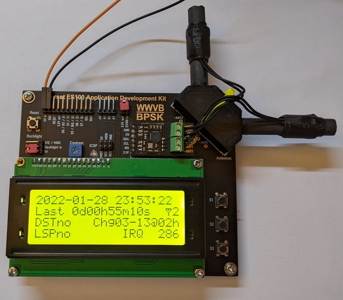

# Everset_ES100_ADK
This repository contains my personal modifications to the [Universal Solder](https://universal-solder.ca/) [Application Development Kit (ADK)](https://universal-solder.ca/product/canaduino-application-development-kit-with-everset-es100-mod-wwvb-bpsk-atomic-clock-receiver-module/) for the [Everset ES100 WWVB-tracking time sync chip](https://everset-tech.com/receivers/).

The [ES100 module](https://universal-solder.ca/product/everset-es100-mod-wwvb-bpsk-phase-modulation-receiver-module/) sold by Universal Solder is a very cool little device that can readily track and decode the transmissions of WWVB long wave radio broadcast from NIST in Fort Collins, Colorado.  WWVB has been transmitting on 60 kHz for decades, but recently has upgraded their signal for better range and accurate detetion, and the ES100 can track and decode this signal, providing time of day, day of year, upcoming leap second status and daylight savings time status. The device has no concept of where it is being operated (unlike GPS, which can potentially deduce time zone rules from location), so its time is inherently provided as UTC, with the offset provided by the user somehow.

Universal Solder provides the example code for operating the ES100 ADK, which is amazing and works well.  However, I wanted to tailor it to my own purpose.  For instance:
- I wanted to provide a "splash" screen at startup, so you can tell immediately if it's doing something
- I wanted to put all important data on the 4 line x 20 char/line screen at once, if possible, to avoid scrolling
- I wanted to use "printf()" to more readily format output strings - actually, "printf()" is not available in this architecture, _and_ I wanted to try to be buffer-length-safe, so I used "snprintf" then "print" and "println"
- I wanted to use compose characters on the LCD (so-called "CG characters, which we used to great effect 30+ yrs ago on a scoreboard system that I designed) where appropriate, to reduce screen usage

I achieved these goals, although I did find good reason for it to be the way it was - very limited memory resources!  I had to cut back on some of the cruft and verbiage, especially in the serial debug output.

_Image of ES100 ADK Running v0i11 of My Revised Code_

During the debugging of my software, I was surprised one day at the rapid loss of signal from WWVB, and I was worried that I had messed up something in the configuration.  I added a function to the ES100 library to read back the control word from the ES100 module and report on the serial port.  It turned out that there was nothing wrong, that's just how rapidly propagation of VLF can change sometimes.  Now, I've backed out the printing of this control word, so my code is compatible with the original library.  The control word print is actually just commented out, so it can be restored if you wish... but I don't see a need at this time.  The change to the library is present in this archive, for completeness, but really only the Arduino Everset_ES100_ADK_V1.ino source file is required, and can be used with the old library just fine.

In order to compile this code, you will need the Arduino system configured per the Arduino UNO board, since the ES100 ADK has the same processor and basic configuration as the UNO.  In order to program the board, I purchased an ATtinyISP board, originally developed by [ladyada](http://www.ladyada.net/) (now [hosted at Adafruit](http://learn.adafruit.com/usbtinyisp) ) and available from [Universal Solder](https://universal-solder.ca/product/usbtinyisp-isp-avr-programmer-atmega-attiny-arduino/), [Adafruit](https://www.adafruit.com/product/46), and others, including through [Amazon Prime](https://smile.amazon.com/HiLetgo-USBTiny-USBtinyISP-Programmer-Bootloader/dp/B01CZVZ1XM/ref=sr_1_2).  The big thing about using this device is that it is not a serial programmer, so using it is slightly different than what you might be used to.  After programmer configuration as "USBtinyISP" in _Tools_ -> _Programmer_, the device is programmed by doing _Sketch_ -> _Upload using Programmer_ Ctrl+Shift+U instead of just _Sketch_ -> _Upload_ Ctrl+U.
